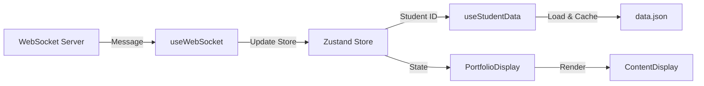

# Portfolio Exhibition System (Mixtapes)

Ein WebSocket-gesteuertes Portfolio-Display-System für Ausstellungen. Entwickelt mit React + Vite für maximale Performance im Offline-Betrieb.

## 🎯 Projektübersicht

Dieses System zeigt Student:innen-Portfolios auf Basis von WebSocket-Triggern an. Alle Inhalte (Texte, Bilder, Videos) liegen lokal im `/public` Ordner und werden dynamisch geladen.

### Hauptmerkmale

- **WebSocket-Steuerung**: Externes System kontrolliert, welches Portfolio und welcher State angezeigt wird
- **Offline-fähig**: Keine Datenbank, alle Daten liegen statisch vor
- **Performance-optimiert**: Aggressive Caching-Strategie, Video-Preloading
- **Single Page Application**: Kein Routing, eine einzige React-Komponente
- **Smooth Transitions**: Fließende Übergänge zwischen Inhalten

## 🏗️ Architektur

### Datenstruktur

```
public/
  students/
    01/
      data.json          # Portfolio-Metadaten
      cover.jpg          # Bilder
      text_intro.txt     # Texte
      project1.mp4       # Videos
    02/
      ...
```

### Beispiel `data.json`

```json
{
  "name": "Magdalena Ackerl",
  "texts": ["text_intro.txt", "text_story.txt"],
  "media": ["cover.jpg", "project1.mp4", "project1.jpg"]
}
```

### WebSocket Message Format

```json
{
  "studentId": "01",
  "state": "text_intro.txt"
}
```

- **studentId**: Ordnername unter `/public/students/`
- **state**: Dateiname des anzuzeigenden Inhalts

## 🔧 Technischer Aufbau

### State Management: Zustand

Zentraler Store für:
- Aktueller Student + State (gesteuert durch WebSocket)
- Gecachte Portfolio-Daten
- Loading- und Error-States
- WebSocket-Verbindungsstatus

**Warum Zustand?**
- Minimaler Boilerplate
- Bessere Performance als Context API
- Sehr kleine Bundle-Größe (~1KB)
- Einfache, intuitive API

### Komponenten-Hierarchie

```
App.tsx
├── useWebSocket Hook (WebSocket-Verbindung)
├── StudentDataLoader (Lädt Portfolio-Daten)
└── PortfolioDisplay
    └── ContentDisplay
        ├── TextContent
        ├── ImageContent
        └── VideoContent
```

### Datenfluß



## 🚀 Installation & Setup

### 1. Dependencies installieren

```bash
npm install
```

**Wichtige Dependencies:**
- `zustand` - State Management
- `react` + `react-dom` - UI Framework
- `vite` - Build Tool

### 2. WebSocket-Server konfigurieren

Standardmäßig verbindet sich die App mit `ws://localhost:8080`.

Um die URL zu ändern, bearbeite `src/hooks/useWebSocket.ts`:

```typescript
const WS_URL = 'ws://your-websocket-server:port';
```

### 3. Portfolio-Inhalte hinzufügen

1. Erstelle einen Ordner unter `public/students/{id}/`
2. Füge eine `data.json` hinzu
3. Lege Texte, Bilder und Videos im selben Ordner ab

### 4. Development Server starten

```bash
npm run dev
```

Die App läuft auf `http://localhost:5173`

## 📡 WebSocket Integration

### Verbindung

Die WebSocket-Verbindung wird automatisch beim App-Start hergestellt.

**Features:**
- Auto-Reconnect bei Verbindungsabbruch (3 Sekunden Delay)
- Verbindungsstatus-Anzeige (oben rechts)
- Fehlerbehandlung

### Nachrichten senden (Beispiel)

```javascript
const ws = new WebSocket('ws://localhost:8080');

ws.onopen = () => {
  // Zeige Portfolio von Student 01, Text-Datei
  ws.send(JSON.stringify({
    studentId: "01",
    state: "text_intro.txt"
  }));

  // Zeige ein Bild
  ws.send(JSON.stringify({
    studentId: "01",
    state: "project1.jpg"
  }));

  // Zeige ein Video
  ws.send(JSON.stringify({
    studentId: "01",
    state: "project1.mp4"
  }));
};
```

## 🎨 Content-Typen

### Text (.txt, .md)

- Wird als formatierter Text angezeigt
- Zeilenumbrüche werden zu Absätzen
- Titel wird aus Dateiname generiert

### Bilder (.jpg, .jpeg, .png, .gif, .webp, .svg)

- Automatisches Preloading beim Laden des Portfolios
- Responsive Darstellung
- Smooth Fade-In beim Laden

### Videos (.mp4, .webm, .mov, .avi)

- Automatisches Preloading
- Autoplay + Loop
- Standard: Muted (für Autoplay-Kompatibilität)
- Eigene Controls

## ⚡ Performance-Optimierungen

### Caching-Strategie

1. **Portfolio-Daten**: Nach erstem Laden im Zustand Store gecached
2. **Media-Preloading**: Beim Laden eines Portfolios werden alle Medien vorgeladen
3. **Selektive Renders**: Zustand Selektoren verhindern unnötige Re-Renders

### Video-Handling

```typescript
// Automatisches Preloading aller Videos
const video = document.createElement('video');
video.preload = 'auto';
video.src = '/students/01/project1.mp4';
```

## 📝 Entwicklung

### Ordnerstruktur

```
src/
├── hooks/
│   ├── useWebSocket.ts      # WebSocket-Verbindung
│   └── useStudentData.ts    # Portfolio-Daten laden
├── components/
│   ├── StudentDataLoader.tsx # Data-Loading Wrapper
│   ├── PortfolioDisplay.tsx  # Haupt-Display
│   ├── PortfolioDisplay.css  # Styling
│   └── ContentDisplay.tsx    # Text/Bild/Video Renderer
├── store.ts                  # Zustand State Management
├── types.ts                  # TypeScript Interfaces
├── App.tsx                   # Main Component
└── App.css                   # Global Styles
```

### Wichtige Dateien

- **`store.ts`**: Zustand Store mit Actions für WebSocket-Updates
- **`useWebSocket.ts`**: WebSocket Hook mit Auto-Reconnect
- **`useStudentData.ts`**: Daten-Loader mit Caching und Preloading
- **`ContentDisplay.tsx`**: Renderer für verschiedene Content-Typen

## 🐛 Troubleshooting

### WebSocket verbindet nicht

1. Überprüfe, ob der WebSocket-Server läuft
2. Prüfe die URL in `src/hooks/useWebSocket.ts`
3. Schaue in die Browser-Konsole für Fehlermeldungen

### Portfolio lädt nicht

1. Überprüfe Ordnerstruktur: `public/students/{id}/data.json`
2. Validiere das JSON-Format der `data.json`
3. Prüfe die Browser-Konsole auf 404-Fehler

### Videos spielen nicht ab

1. Browser-Autoplay-Policy beachten (Videos sind muted)
2. Unterstützte Formate: MP4, WebM
3. Dateigröße beachten (große Videos können langsam laden)

### Styling-Probleme

- Überprüfe `src/components/PortfolioDisplay.css`
- Browser-Cache leeren
- DevTools öffnen und Styles inspizieren

## 🚢 Production Build

```bash
npm run build
```

Output im `dist/` Ordner. Kann auf jedem statischen Webserver gehostet werden.

### Offline-Betrieb

1. Build erstellen: `npm run build`
2. `dist/` Ordner auf Ausstellungs-Rechner kopieren
3. Mit lokalem Server starten (z.B. `python -m http.server` im `dist/` Ordner)
4. WebSocket-Server lokal starten

## 📚 Weitere Befehle

```bash
npm run dev       # Development Server
npm run build     # Production Build
npm run preview   # Preview Production Build
npm run lint      # ESLint Check
```

## 🎓 Beispiel-Workflow

1. **WebSocket-Server startet** und wartet auf Trigger
2. **Externes System sendet**: `{ studentId: "01", state: "text_intro.txt" }`
3. **App reagiert**:
   - WebSocket empfängt Nachricht
   - Store wird aktualisiert
   - Portfolio-Daten von Student 01 werden geladen (falls noch nicht cached)
   - Text-Datei wird gerendert
4. **Nächster Trigger**: `{ studentId: "01", state: "project1.mp4" }`
5. **App zeigt Video** (bereits vorgeladen, startet sofort)

---

**Entwickelt für eine Ausstellung mit Fokus auf Performance und Zuverlässigkeit im Offline-Betrieb.**

